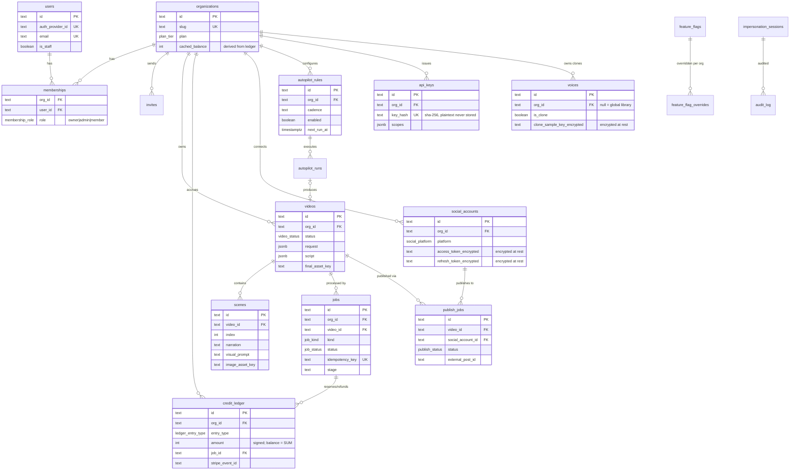

# Database schema (FAV-302)

Postgres dialect via Drizzle ORM. Source of truth: `packages/db/src/schema.ts`.
Migrations live in `packages/db/migrations/` and apply identically to embedded
PGlite (dev) and managed Postgres (prod).

## ER diagram

## Ledger semantics (FAV-303 / FAV-904)

| entry_type | sign | when |
|---|---|---|
| `grant` | + | subscription grant, starter credits, monthly reset |
| `purchase` | + | one-time top-up (never expires) |
| `reservation` | − | job start; guarded by race-safe balance check |
| `reservation_release` | + | job success where actual cost < reserved |
| `refund` | + | terminal job failure — full compensation |
| `adjustment` | ± | manual admin action (audited) |
| `reset` | ± | monthly allotment reconciliation |

Invariants (unit-tested in `packages/db/src/ledger.test.ts`):
- rows are never updated or deleted; balance = `SUM(amount)` per org
- at most one `reservation`, `reservation_release`, and `refund` per job
  (partial unique index), so workflow retries can't double-charge
- `organizations.cached_balance` is a cache, recomputed from the ledger
